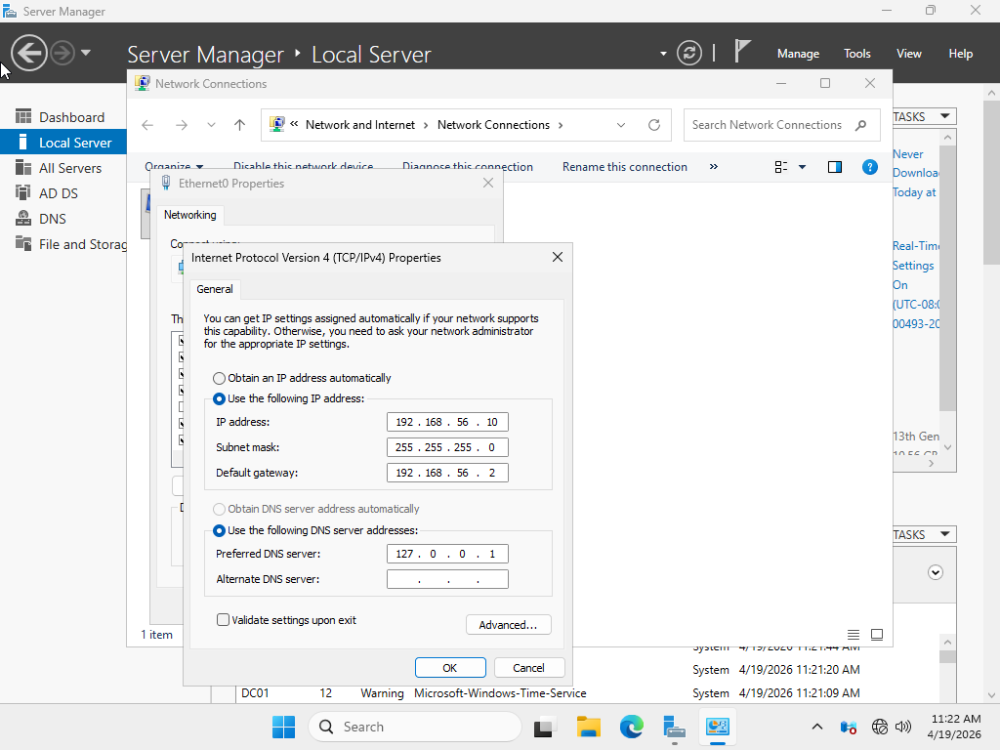
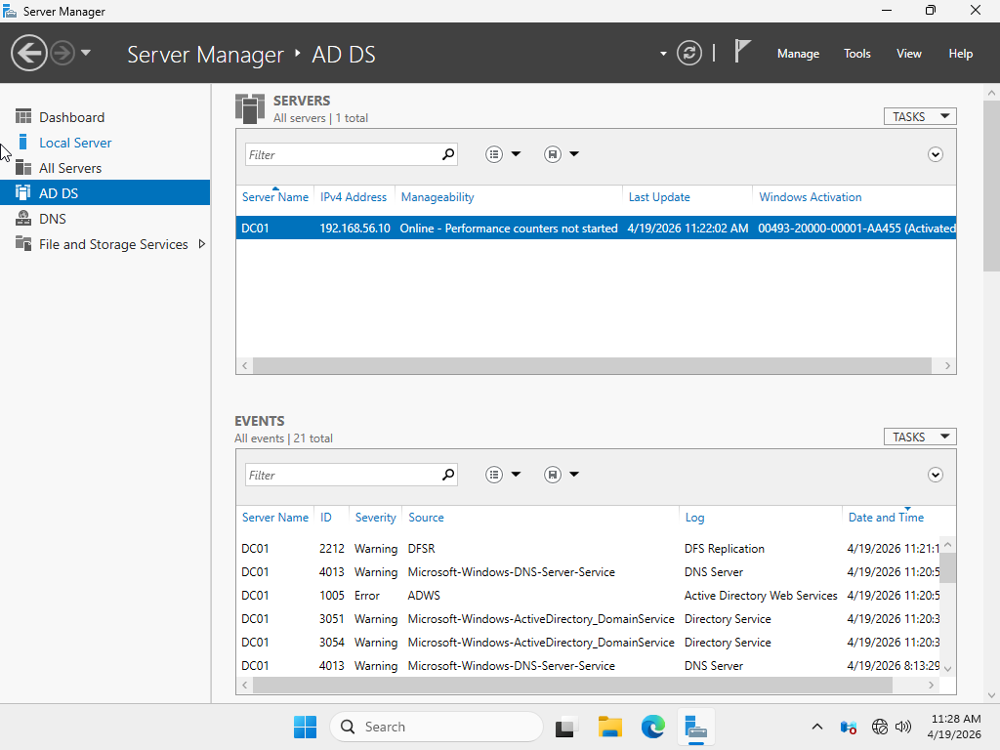

# Enterprise Active Directory Helpdesk Lab

## Project Overview

This project is a Windows Server and Active Directory home lab designed to simulate common entry-level Help Desk and IT Support tasks in a small business environment.

The lab includes setting up a domain controller, creating Active Directory users and security groups, organizing resources with OUs, and configuring department-based shared folders with Share and NTFS permissions.

---

## Lab Environment

- VMware Workstation
- Windows Server 2025
- Active Directory Domain Services
- DNS
- File Sharing
- NTFS Permissions

---

## Network Design

| Device | Role | Hostname | Status |
|---|---|---|---|
| Windows Server | Domain Controller | DC01 | Completed |
| Windows Client | Domain Client | CLIENT01 | Completed |

- Domain: `pouyabey.local`
- Domain Controller: `DC01`
- Shared folder path: `C:\Shares`

---

## Completed Work

| Step | Task | Status |
|---|---|---|
| 1 | Created `DC01` virtual machine in VMware Workstation | Completed |
| 2 | Attached Windows Server ISO | Completed |
| 3 | Downloaded Windows 10/11 ISO for CLIENT01 | Completed |
| 4 | Configured static IP on `DC01` | Completed |
| 5 | Installed Active Directory Domain Services | Completed |
| 6 | Promoted `DC01` to Domain Controller | Completed |
| 7 | Created domain `pouyabey.local` | Completed |
| 8 | Created OU structure for users, groups, and computers | Completed |
| 9 | Created department-based user accounts | Completed |
| 10 | Created department-based security groups | Completed |
| 11 | Created shared folders for each department | Completed |
| 12 | Configured Share and NTFS permissions | Completed |
| 13 | Verified network shares from `\\DC01` | Completed |

---

## Active Directory Structure

```text
pouyabey.local
|
├── RetailCorp
|   ├── Users
|   |   ├── HR
|   |   ├── Finance
|   |   ├── IT
|   |   ├── Operations
|   |   └── Sales
|   ├── Groups
|   └── Computers


```

---

## Users and Groups

| Department | Security Group | Shared Folder |
|---|---|---|
| HR | `HR_Users` | `\\DC01\HR` |
| Finance | `Finance_Users` | `\\DC01\Finance` |
| IT | `IT_Users` | `\\DC01\IT` |
| Operations | `Operation_Users` | `\\DC01\Operations` |
| Sales | `Sales_Users` | `\\DC01\Sales` |

Each department user was added to the matching department security group.

---

## Shared Folder Permission Model

For this lab, I used Share permissions and NTFS permissions together:

- Share Permission: `Everyone = Full Control`
- NTFS Permission: `Department Group = Modify`

This allows the shares to be reachable over the network while NTFS permissions control the actual folder access.

| Shared Folder | Allowed Group | NTFS Permission |
|---|---|---|
| `\\DC01\HR` | `HR_Users` | Modify |
| `\\DC01\Finance` | `Finance_Users` | Modify |
| `\\DC01\IT` | `IT_Users` | Modify |
| `\\DC01\Operations` | `Operation_Users` | Modify |
| `\\DC01\Sales` | `Sales_Users` | Modify |

---

## Screenshots

### VMware Lab Setup


### Static IP Configuration



### Active Directory Domain Services



### Organizational Unit Structure


### Users and Security Groups


### Shared Folders and Permissions


### Network Shares Verification


---

## Current Status

This phase of the lab is complete through shared folder creation and permissions.

Next phase:

- Create `CLIENT01`
- Configure DNS on `CLIENT01`
- Join `CLIENT01` to `pouyabey.local`
- Test domain login
- Test shared folder access
- Practice Help Desk scenarios such as password reset, account unlock, and folder access troubleshooting
