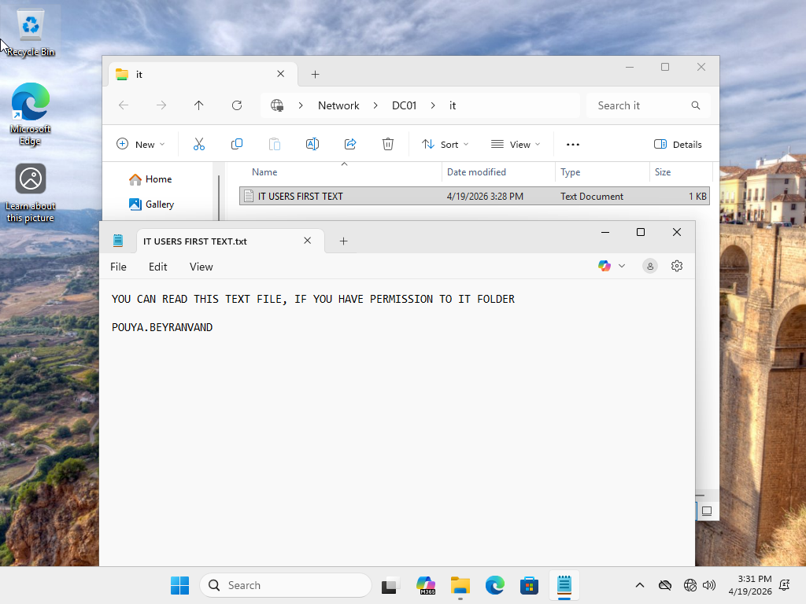
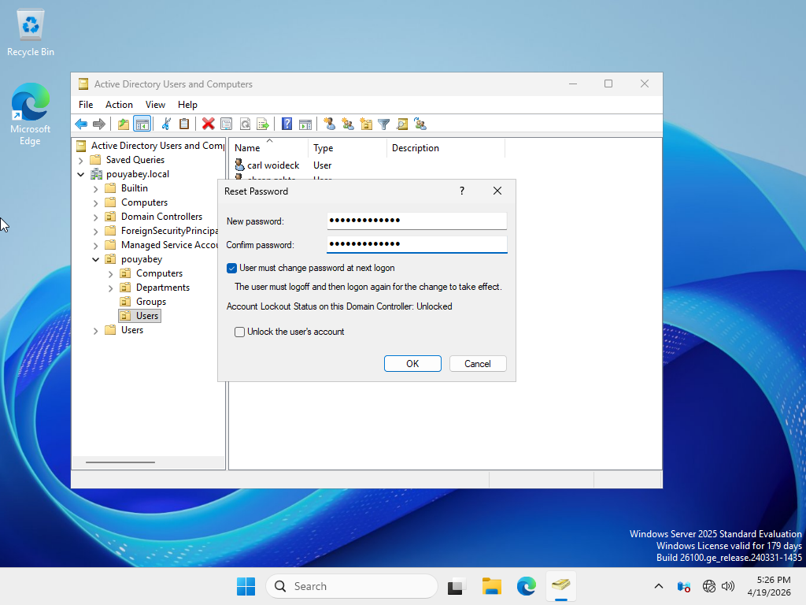
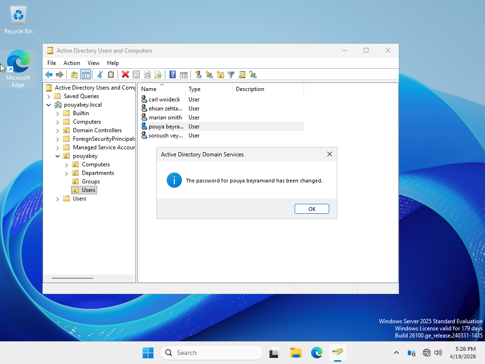
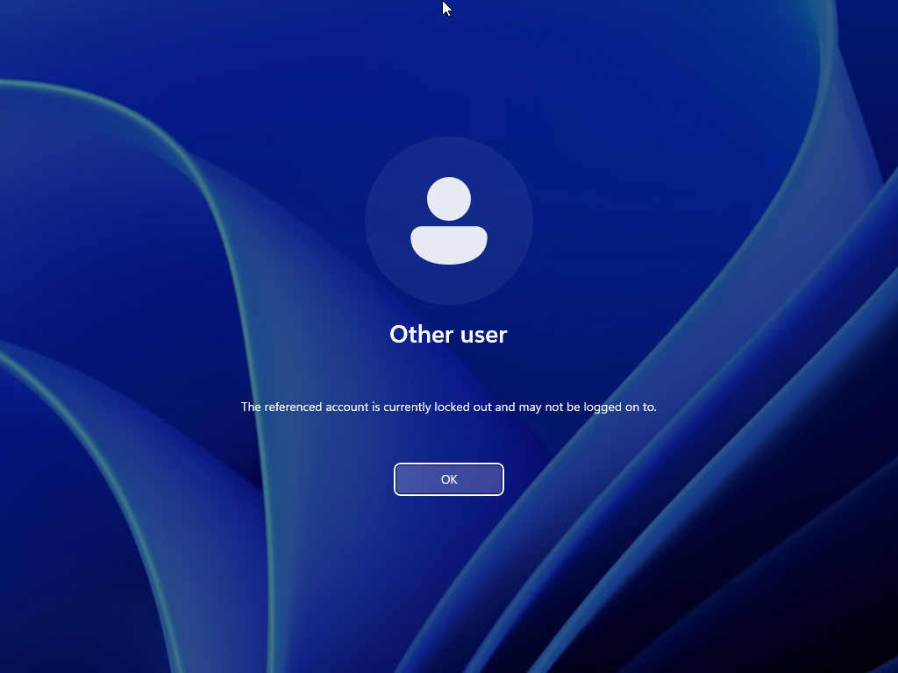
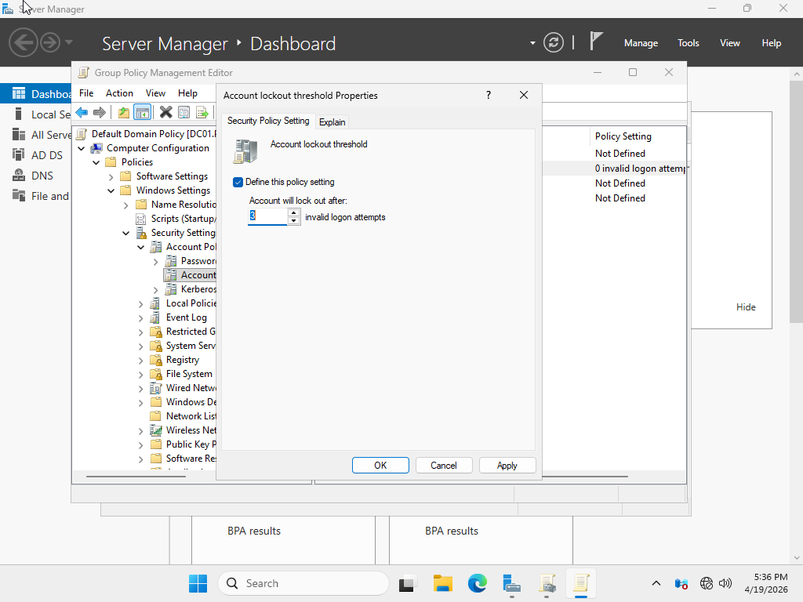
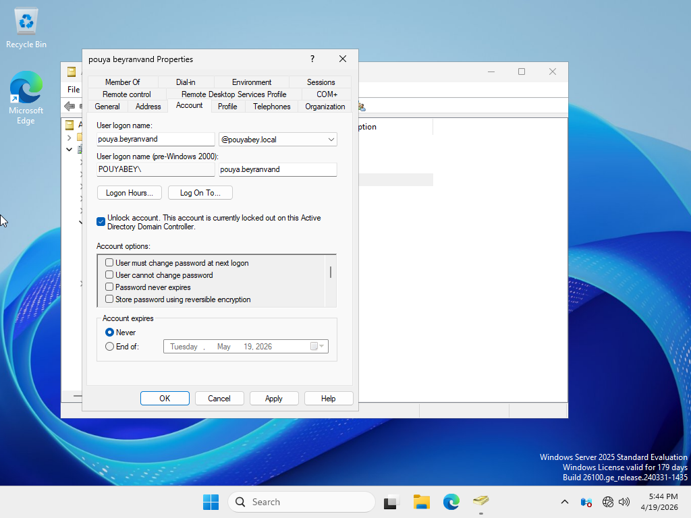
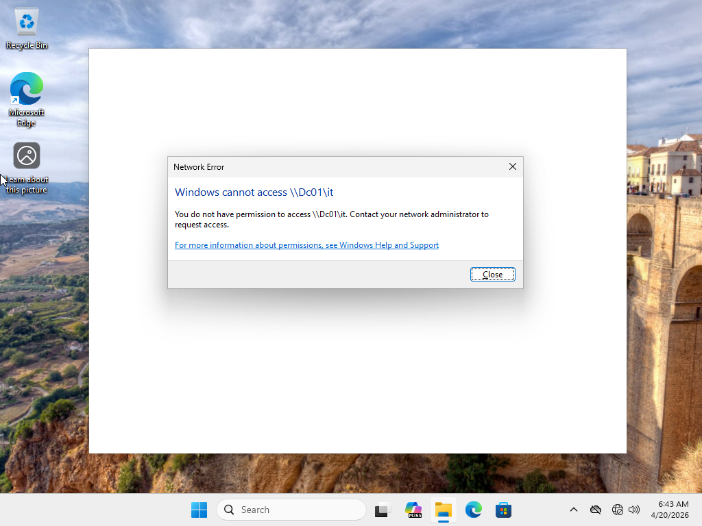
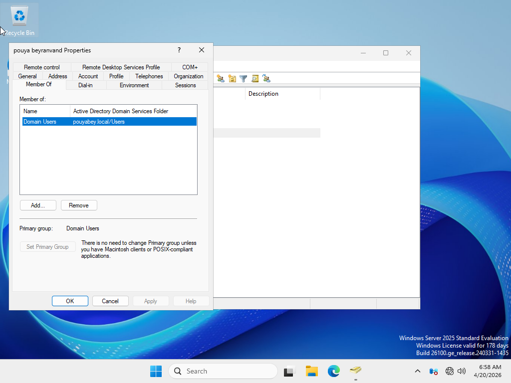

# Enterprise Active Directory Helpdesk Lab

## Project Overview

This project is a Windows Server and Active Directory home lab designed to simulate common entry-level Help Desk and IT Support tasks in a small business environment.

The lab includes setting up a domain controller, creating Active Directory users and security groups, organizing resources with OUs, and configuring department-based shared folders with Share and NTFS permissions.

---

## Lab Environment

- VMware Workstation
- Windows Server 2025
- Active Directory Domain Services
- DNS
- File Sharing
- NTFS Permissions

---

## Network Design

| Device | Role | Hostname | Status |
|---|---|---|---|
| Windows Server | Domain Controller | DC01 | Completed |
| Windows Client | Domain Client | CLIENT01 | planned |

- Domain: `pouyabey.local`
- Domain Controller: `DC01`
- Shared folder path: `C:\Shares`

---

## Completed Work

## Completed Work

| Step | Task | Status |
|---|---|---|
| 1 | Created `DC01` virtual machine in VMware Workstation | Completed |
| 2 | Attached Windows Server ISO to `DC01` | Completed |
| 3 | Downloaded Windows 11 ISO for `CLIENT01` | Completed |
| 4 | Configured static IP on `DC01` | Completed |
| 5 | Installed Active Directory Domain Services | Completed |
| 6 | Promoted `DC01` to Domain Controller | Completed |
| 7 | Created domain `pouyabey.local` | Completed |
| 8 | Created OU structure for computers, departments, groups, and users | Completed |
| 9 | Created department-based user accounts | Completed |
| 10 | Created department-based security groups | Completed |
| 11 | Created shared folders for each department | Completed |
| 12 | Configured Share and NTFS permissions | Completed |
| 13 | Created `CLIENT01` virtual machine | Completed |
| 14 | Configured `CLIENT01` DNS to point to `DC01` | Completed |
| 15 | Joined `CLIENT01` to the `pouyabey.local` domain | Completed |
| 16 | Tested domain user login on `CLIENT01` | Completed |
| 17 | Tested shared folder permissions | Completed |
| 18 | Practiced password reset in Active Directory | Completed |
| 19 | Practiced account unlock in Active Directory | Completed |
| 20 | Practiced folder access troubleshooting | Completed |
| 21 | Captured screenshots for documentation | Completed |
| 22 | Wrote GitHub README documentation | Completed |
| 23 | Prepared project for resume/portfolio use | Completed |

---

## Active Directory Structure

```text
pouyabey.local
|
├── Computers
├── Departments
|   ├── HR
|   ├── Finance
|   ├── IT
|   ├── Operations
|   └── Sales
├── Groups
└── Users
```

## Users and Groups

| Department | Security Group | Shared Folder |
|---|---|---|
| HR | `HR_Users` | `\\DC01\HR` |
| Finance | `Finance_Users` | `\\DC01\Finance` |
| IT | `IT_Users` | `\\DC01\IT` |
| Operations | `Operation_Users` | `\\DC01\Operations` |
| Sales | `Sales_Users` | `\\DC01\Sales` |

Each department user was added to the matching department security group.

---

## Shared Folder Permission Model

For this lab, I used Share permissions and NTFS permissions together:

- Share Permission: `Everyone = Full Control`
- NTFS Permission: `Department Group = Modify`

This allows the shares to be reachable over the network while NTFS permissions control the actual folder access.

| Shared Folder | Allowed Group | NTFS Permission |
|---|---|---|
| `\\DC01\HR` | `HR_Users` | Modify |
| `\\DC01\Finance` | `Finance_Users` | Modify |
| `\\DC01\IT` | `IT_Users` | Modify |
| `\\DC01\Operations` | `Operation_Users` | Modify |
| `\\DC01\Sales` | `Sales_Users` | Modify |

---

## CLIENT01 Virtual Machine

I created a Windows client virtual machine named `CLIENT01` in VMware Workstation. This machine will be used to test domain joining, domain user login, and shared folder access.

Configuration:

- Hostname: `CLIENT01`
- Operating System: Windows 10/11 Pro
- Network Adapter: Same virtual network as `DC01`
- Purpose: Domain-joined client workstation for Help Desk testing
---

## CLIENT01 DNS Configuration

Configured the DNS settings on `CLIENT01` to point to the domain controller `DC01`. This allows the client machine to locate the Active Directory domain and prepare for domain join.

- CLIENT01 IP Address: `192.168.56.20`
- Preferred DNS Server: `192.168.56.10`
- DNS Server: `DC01`

---

## CLIENT01 Domain Join

Joined the `CLIENT01` Windows client machine to the `pouyabey.local` Active Directory domain.

Before joining the domain, I configured the client DNS settings to point to the domain controller `DC01`. After the domain join, the client machine was restarted and verified as a domain-joined workstation.

- Client hostname: `CLIENT01`
- Domain: `pouyabey.local`
- Domain Controller / DNS Server: `DC01`
- DNS Server IP: `192.168.56.10`

---

## Domain Login Test

Tested domain user login on `CLIENT01` after joining the workstation to the `pouyabey.local` domain.

A domain user account was used to sign in to the client machine. The login was verified using Command Prompt.

- Client: `CLIENT01`
- Domain: `pouyabey.local`
- Domain User: `pouya.beyranvand`
- Verified with: `whoami`, `%USERDOMAIN%`, and `%USERNAME%`
---

## Shared Folder Permission Test

Tested department-based shared folder permissions from the domain-joined client machine `CLIENT01`.

I logged in with the domain user `pouya.beyranvand`, which is a member of the `IT_Users` security group. The user was able to access the IT shared folder and create/read a test text file, confirming that the correct NTFS permissions were applied.

The same user attempted to access the HR shared folder, but access was denied because the user is not a member of the `HR_Users` group.

| Test User | Group Membership | Folder Tested | Result |
|---|---|---|---|
| `pouya.beyranvand` | `IT_Users` | `\\DC01\IT` | Access granted |
| `pouya.beyranvand` | `IT_Users` | `\\DC01\HR` | Access denied |

---

## Password Reset Practice

Practiced a common Help Desk task by resetting a domain user's password in Active Directory Users and Computers.

In this scenario, the domain user `pouya.beyranvand` was treated as a user who forgot their password. I reset the password from `DC01` and enabled the option requiring the user to change the password at next logon. The user was then able to sign in successfully from `CLIENT01`.

| Task | Result |
|---|---|
| Located user in Active Directory | Completed |
| Reset user password | Completed |
| Required password change at next logon | Enabled |
| Tested login from CLIENT01 | Successful |
---

## Account Unlock Practice

Practiced a common Help Desk scenario by locking and unlocking a domain user account.

In this scenario, the domain user `pouya.beyranvand` entered the wrong password multiple times on `CLIENT01`, which triggered the domain account lockout policy. The account was then unlocked from Active Directory Users and Computers on `DC01`, and the user was able to log in successfully again.

| Task | Result |
|---|---|
| Configured account lockout policy | Completed |
| Triggered account lockout with failed login attempts | Completed |
| Unlocked account in Active Directory | Completed |
| Verified successful login after unlock | Completed |

---

## Folder Access Troubleshooting

Practiced a common Help Desk troubleshooting scenario where a domain user could not access their department shared folder.

In this scenario, the user `pouya.beyranvand` was unable to access the IT shared folder. I investigated the issue by verifying the logged-in domain account, checking the shared folder path, and reviewing the user's Active Directory group membership.

The root cause was that the user was missing from the `IT_Users` security group. After adding the user back to the correct group and signing out/signing back in, access to the IT shared folder was restored.

| Troubleshooting Step | Result |
|---|---|
| Verified domain login on CLIENT01 | Confirmed |
| Tested access to `\\DC01\IT` | Access denied |
| Checked AD group membership | `IT_Users` was missing |
| Added user to `IT_Users` group | Completed |
| Re-tested folder access | Access restored |

---


## Screenshots

### VMware Lab Setup


### Static IP Configuration


### Active Directory Domain Services


### Organizational Unit Structure


### Users and  Groups


### Shared Folders and Permissions


### Network Shares Verification


### CLIENT01 Virtual Machine Setup


### CLIENT01 DNS Settings


### CLIENT01 Domain Membership Verification


### Domain Login Verification


### IT Folder Access Test



### HR Folder Access Denied


### Password Reset in Active Directory



### Password Reset Success




### Account Locked Message



### Account Lockout Policy



### Unlock Account in Active Directory



### Access Denied Before Fix



### Missing Group Membership




---


