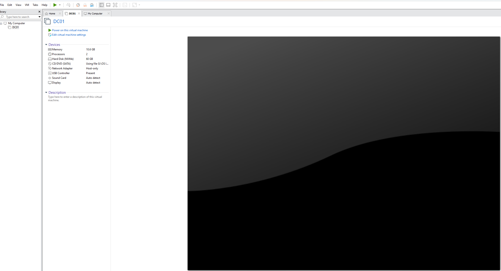

# Enterprise Active Directory Helpdesk Lab

## Project Overview

This project is a hands-on Windows Server and Active Directory home lab designed to simulate common entry-level Help Desk and IT Support tasks in a small enterprise environment.

The goal of this lab is to practice building a Windows domain environment, creating Active Directory users and groups, organizing resources with OUs, and configuring shared folders with department-based permissions.

This lab is built for practicing real-world Help Desk tasks such as user management, group-based access control, and Windows file sharing.

---

## Lab Environment

- VMware Workstation / VirtualBox
- Windows Server 2025
- Windows 11 Pro
- Active Directory Domain Services
- DNS
- File Sharing
- NTFS Permissions

---

## Lab Network Design

| Device | Role | Hostname | Notes |
|---|---|---|---|
| Windows Server | Domain Controller | DC01 | Hosts Active Directory, DNS, and shared folders |
| Windows 11 Client | Domain Client | CLIENT01 | Will be joined to the domain in the next phase |

Domain name:

`pouyabey.local`

Domain Controller:

`DC01`

Shared folders location:

`C:\Shares`

---

## 1. Installed VMware / VirtualBox

I used VMware Workstation to create an isolated lab environment for Windows Server and Windows client machines. This allows me to safely practice system administration and Help Desk tasks without affecting a real production environment.



---

## 2. Downloaded Windows Server ISO

I downloaded the Windows Server ISO to install the server operating system for the domain controller.

The Windows Server VM will be used to host:

- Active Directory Domain Services
- DNS
- Domain user accounts
- Security groups
- Shared folders

**Screenshot to add:**

`/screenshots/02-windows-server-iso.png`

Suggested screenshot: Windows Server ISO file or VM setup screen showing the ISO selected.

---

## 3. Downloaded Windows 10/11 ISO

I also downloaded a Windows 10/11 ISO to create a client workstation. This client machine will later be joined to the domain and used to test domain login and shared folder access.

**Screenshot to add:**

`/screenshots/03-windows-client-iso.png`

Suggested screenshot: Windows 10/11 ISO file or VM setup screen showing the ISO selected.

---

## 4. Created the DC01 Virtual Machine

I created a Windows Server virtual machine and named it:

`DC01`

This server will act as the main domain controller for the lab environment.

**Screenshot to add:**

`/screenshots/04-dc01-vm-created.png`

Suggested screenshot: VMware/VirtualBox showing the `DC01` virtual machine.

---

## 5. Configured Static IP on DC01

I configured a static IP address on the domain controller. A domain controller should have a static IP address because client machines need to consistently locate it for DNS and Active Directory services.

Example configuration:

- IP Address: `192.168.10.10`
- Subnet Mask: `255.255.255.0`
- Default Gateway: `192.168.10.1`
- Preferred DNS: `192.168.10.10`

**Screenshot to add:**

`/screenshots/05-dc01-static-ip.png`

Suggested screenshot: IPv4 properties page showing the static IP configuration.

---

## 6. Installed Active Directory Domain Services

I installed the Active Directory Domain Services role on `DC01` using Server Manager.

This role allows the server to manage domain users, computers, groups, and policies.

**Screenshot to add:**

`/screenshots/06-ad-ds-role-installed.png`

Suggested screenshot: Server Manager showing Active Directory Domain Services installed.

---

## 7. Promoted DC01 to Domain Controller

After installing AD DS, I promoted `DC01` to a domain controller.

This step converts the Windows Server machine into the main server responsible for managing the domain.

**Screenshot to add:**

`/screenshots/07-dc01-promoted-domain-controller.png`

Suggested screenshot: Server Manager or promotion wizard completion screen.

---

## 8. Created the Domain: retailcorp.local

I created a new Active Directory forest with the domain name:

`retailcorp.local`

This domain simulates a small business environment called RetailCorp.

**Screenshot to add:**

`/screenshots/08-domain-retailcorp-created.png`

Suggested screenshot: Active Directory Users and Computers showing `retailcorp.local`.

---

## 9. Created Organizational Units

I created Organizational Units to organize users, groups, and computers in a structured way.

The OU structure helps simulate how companies separate departments and resources in Active Directory.

Example OU structure:

```text
pouyabey.local
│
├── RetailCorp
│   ├── Users
│   ├── Groups
│   └── Computers
```
Inside the Users OU, I created department-based OUs:

- HR
- Finance
- IT
- Operations
- Sales

**Screenshot:**


---

## 10. Created Users

I created test user accounts to represent employees in different departments.

Example users:

| User | Department |
|---|---|
| HR User | HR |
| Finance User | Finance |
| IT User | IT |
| Operations User | Operations |
| Sales User | Sales |

These accounts will later be used to test domain login and department-based folder access.

**Screenshot:**


---

## 11. Created Security Groups

I created department-based security groups to manage folder access.

Groups created:

- `HR_Users`
- `Finance_Users`
- `IT_Users`
- `Operation_Users`
- `Sales_Users`

Each user was added to their matching department group.

Example:

- HR user → `HR_Users`
- Finance user → `Finance_Users`
- IT user → `IT_Users`
- Operations user → `Operation_Users`
- Sales user → `Sales_Users`

Using groups instead of assigning permissions directly to individual users is a better practice because it makes access management easier and more scalable.

**Screenshot:**


**Optional screenshot:**


---

## 12. Created Shared Folders

I created department-based shared folders on the domain controller to simulate company file shares.

Folder location on DC01:

`C:\Shares`

Folders created:

- `C:\Shares\HR`
- `C:\Shares\Finance`
- `C:\Shares\IT`
- `C:\Shares\Operations`
- `C:\Shares\Sales`

Network share paths:

- `\\DC01\HR`
- `\\DC01\Finance`
- `\\DC01\IT`
- `\\DC01\Operations`
- `\\DC01\Sales`

**Screenshot:**


---

## Shared Folder Permissions

For this lab, I configured both Share permissions and NTFS permissions.

Share permissions control access to the folder over the network.

NTFS permissions control the actual permissions on the folder and files.

For this lab, I used the following approach:

- Share Permission: `Everyone = Full Control`
- NTFS Permission: `Department Group = Modify`

This means the share is reachable over the network, but the actual access is controlled by NTFS permissions.

Department access design:

| Shared Folder | Network Path | Allowed Group | NTFS Permission |
|---|---|---|---|
| HR | `\\DC01\HR` | `HR_Users` | Modify |
| Finance | `\\DC01\Finance` | `Finance_Users` | Modify |
| IT | `\\DC01\IT` | `IT_Users` | Modify |
| Operations | `\\DC01\Operations` | `Operation_Users` | Modify |
| Sales | `\\DC01\Sales` | `Sales_Users` | Modify |

**Screenshot:**


**Screenshot:**


**Screenshot:**


---

## Verified Network Shares

I verified that the shared folders are visible from the network path:

`\\DC01`

The department shares appeared successfully.

The following default Active Directory shares also appeared:

- `NETLOGON`
- `SYSVOL`

These are normal system shares automatically created on a domain controller. `NETLOGON` and `SYSVOL` are used by Active Directory for domain logon and Group Policy-related files.

**Screenshot:**


---

## Current Lab Status

Completed so far:

- Installed VMware Workstation
- Created the `DC01` server VM
- Configured static IP on `DC01`
- Installed Active Directory Domain Services
- Promoted `DC01` to Domain Controller
- Created the `retailcorp.local` domain
- Created Organizational Units
- Created users
- Created security groups
- Created department-based shared folders
- Configured share and NTFS permissions
- Verified network shares from `\\DC01`

Next steps:

- Create `CLIENT01` Windows client VM
- Set DNS on `CLIENT01` to the DC01 IP address
- Join `CLIENT01` to the domain
- Test domain login
- Test shared folder permissions
- Practice Help Desk scenarios such as password reset, account unlock, and folder access troubleshooting

---

## Screenshot Checklist

- `./screenshots/09-ou-structure.png`
- `./screenshots/10-users-created.png`
- `./screenshots/11-security-groups-created.png`
- `./screenshots/11-user-added-to-group.png`
- `./screenshots/12-shares-folder-structure.png`
- `./screenshots/13-hr-advanced-sharing.png`
- `./screenshots/14-hr-share-permissions.png`
- `./screenshots/15-hr-ntfs-permissions.png`
- `./screenshots/16-network-shares-visible.png`


